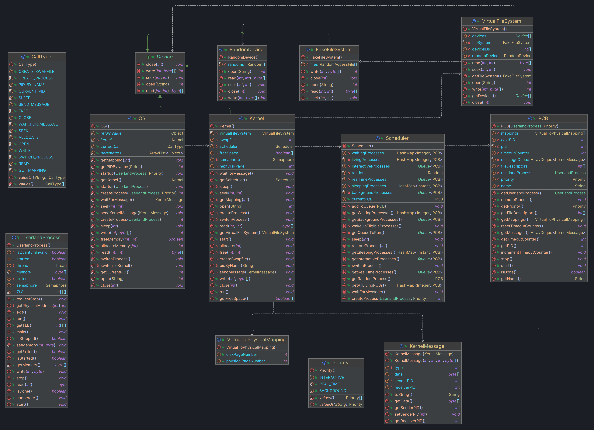

# Operating System
This project replicates a simple operating system in Java. The project is multithreaded, but the OS emulates a single core machine where only one process is running at any given time.

This OS uses cooperative multitasking in order to "play nice" with Java threads. This means that a process **must** call `cooperate()` at some point. Otherwise, the scheduler will never be able to switch processes (at least until the selfish process finishes).

Devices, message passing, and filesystems are supported. Additionally, the OS uses paging and virtual memory to manage memory for all processes.

This project was created as part of the Operating Systems class ICSI 412 Spring 2024.

## Use
1. Clone the repository and build the project.
2. Create a number of userland processes (or use those provided).
3. In `Main.java`, call `OS.startup(UserlandProcess)` for the first process. Then `OS.createProcess(UserlandProcess)` for each process after the first. Optionally, priority may be assigned using the enums `REAL_TIME`, `INTERACTIVE`, and `BACKGROUND`.
4. Run the main class.
5. Watch it run! Note that the OS will never terminate on its own. Even if there are no user-generated processes remaining, the `Idle` process will continue to run.

## UML
Note: UserlandProcess classes and those related to unit testing have been removed for brevity.
